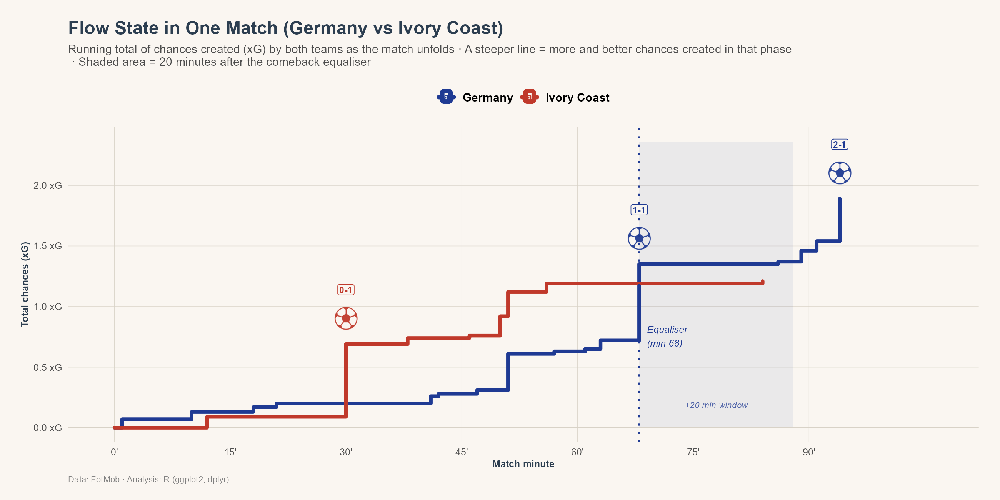
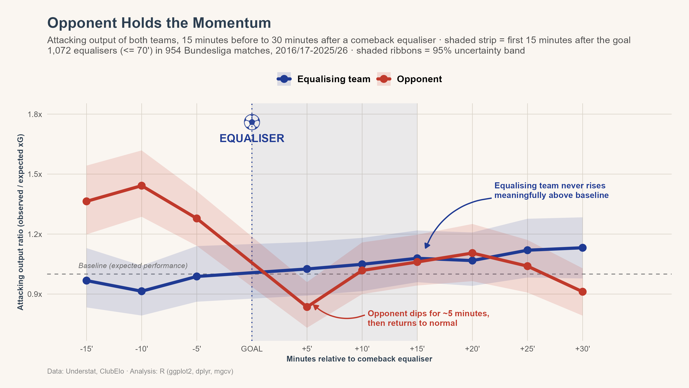
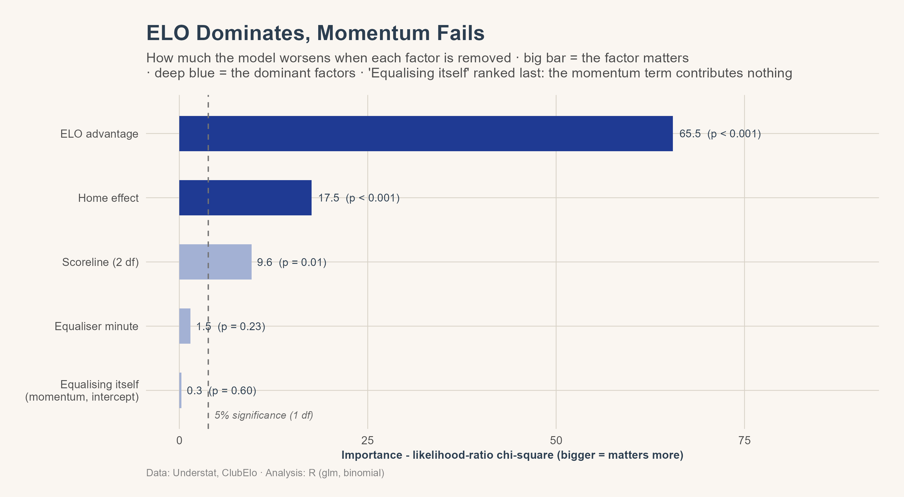

# FLOW STATE AFTER A COMEBACK GOAL


*Bundesliga 2016/17–2025/26, 10 seasons · R · Logistic + Tweedie GAM*

**Does scoring a comeback goal create a measurable attacking momentum window?**


An end-to-end empirical test of the "momentum" narrative in football, using ten
seasons of shot-level Bundesliga data.  Testing the "momentum" football fans and commentators take for granted: that a team who just leveled the score plays better and is more likely to score the next goal too.

## The Question

When a losing team scores to level the match, commentators describe them as having "all the momentum." This project tests that claim two ways:

1. **Performance** — does the equalising team's attacking output (expected goals, xG) rise above what their quality and match context would predict, in the minutes after the goal?
2. **Outcome** — is the equalising team more likely to score the *next* goal than a coin flip, once team quality is controlled for?

Both are testable from public shot-level data. Neither turned out to support the fan-intuition version of "momentum" — but the *mechanism* behind why it looks real is the more interesting finding.


---

## The Momentum Fans Feel

Watch any single comeback and the momentum looks obvious. In the World Cup 2026 Round of 16, Germany went down 0–1 to Ivory Coast, equalised in the 68th minute, and then took over — their chance-creation rate more than tripled in the rest of the match (0.011 xG/min before the equaliser vs 0.042 xG/min after) on the way to a 2–1 win.



This is exactly the kind of match that gives "momentum" its reputation. The question is whether it's the rule or a highlight-reel exception — averaged across all 1,072 comparable Bundesliga comebacks, the picture below tells a different story.

---
## Headline findings

| Question | Result | Evidence |
|---|---|---|
| RQ1 — post-equaliser surge | **No effect.** Equalising teams produce +1.8% xG vs a counterfactual model — well inside normal fluctuation | Placebo test, p = 0.54 |
| RQ1 — the other side | The **conceding** team dips ~16% below expectation for ~5 minutes, then normalises — short-lived and borderline (p ≈ 0.10 over 15 min) | Event-study + placebo |
| RQ2 — next-goal advantage | **Coin flip.** Odds ratio 1.07 [0.94, 1.22], p = 0.29 at equal strength and neutralised venue | Symmetric logistic model |
| What *does* decide the next goal | Team strength (OR 1.44 per 100 ELO points) and home advantage (OR 1.31 ≈ 150 ELO points) | Logistic model, both p < 0.001 |

**Conclusion:** the equaliser changes the scoreboard, not the football. Both
teams subsequently perform as their strength, venue and game state predict.
The only detectable reaction is a brief dip by the team that conceded.

This is the "momentum debunked" outcome — a legitimate, well-supported result, not a null finding from a project that failed to find anything.





The complete set (event studies, placebo inference, robustness, logistic
diagnostics) is in `output/figures/report/`.

---

## Data

| Source | Content | Coverage |
|---|---|---|
| [Understat](https://understat.com) | Shot-level data (xG, minute, result, situation) | Bundesliga 2016/17–2025/26 · 3,059 matches · 79,723 shots |
| [ClubElo](http://clubelo.com) | Pre-match team strength ratings | 100% of matches, joined per match date |

From these, three model-ready datasets are constructed
(`R/01_build_datasets.R`):

- **`goal_events`** — every goal in order, with running score and equaliser
  flags (own-goal credit validated against final scores: 100% of matches
  reconcile).
- **`team_windows`** — one row per team × match × 5-minute bin (110,124
  rows) with xG, shots, score state, ELO difference, and treatment /
  washout flags around each of the **1,547 qualifying equalisers**.
- **`equaliser_events`** — one row per qualifying equaliser with the
  next-goal outcome.

Raw data are not redistributed here; the collection scripts
(`data_collection/`) rebuild them from the public sources, and
`data_collection/03_validate.py` verifies the result (season completeness,
score reconciliation, coordinate ranges, ELO coverage). One match is
legitimately absent: Holstein Kiel vs Bochum 2024/25 was abandoned and later
awarded by the DFB court; Understat carries no shot data for it.

## Methodology

**RQ1 — counterfactual xG model.** A Tweedie GAM (log link, variance power
estimated at p = 1.53) is fitted on all *non-comeback* 5-minute windows,
learning normal attacking output as a function of score state, match time,
ELO difference, venue and season (calibration within ±3% in every game
situation). Post-equaliser windows are held out; the treatment effect is the
gap between their observed and predicted xG. Inference comes from a placebo
distribution of 1,000 matched sets of ordinary level-score windows.
Robustness: shot counts (Poisson), stoppage-bin exclusion, truncation at the
next goal, and the conceding team as a mirror group.

**RQ2 — symmetric logistic model.** Among equalisers followed by another
goal (n = 968), the outcome is whether the equalising team scored it. Both
covariates — ELO difference and venue — are coded to flip sign under a team
swap, so under a no-momentum null the intercept is exactly zero: the
intercept *is* the hypothesis test. Standard errors are match-clustered;
censoring ("no further goal", 37%) is shown to be unrelated to team quality
and venue, and worst-case bounds are reported.

## Repository structure

```
├── config.py / config.R        central paths + visual identity (no hardcoded paths)
├── data_collection/            Python: Understat pull, ClubElo pull, validation
│   ├── 01_pull_understat.py
│   ├── 02_pull_clubelo.py
│   └── 03_validate.py
├── R/
│   ├── install_packages.R      R dependencies (installs only what is missing)
│   ├── 01_build_datasets.R     goal_events · team_windows · equaliser_events
│   ├── 02_train_poisson_model.R   RQ1: Tweedie counterfactual + placebo + robustness
│   ├── 03_train_logistic_model.R  RQ2: symmetric logistic + censoring checks
│   └── 04_report_figures.R     all 10 report figures
├── notebooks/                  exploratory data analysis
├── assets/football_icons/      goal-marker icons used by the figures
├── output/
│   ├── tables/                 full model outputs (h1_poisson_results.txt, h2_logistic_results.txt)
│   └── figures/report/         all figures (300 dpi)
└── world_cup_2026/             standalone single-match case studies (presentation demo)
```

## Reproducing the analysis

```bash
# 1. Collect and validate raw data (Python 3.11+)
pip install -r requirements.txt
python data_collection/01_pull_understat.py
python data_collection/02_pull_clubelo.py
python data_collection/03_validate.py

# 2. Analysis (R >= 4.4, run from the project root)
Rscript R/install_packages.R
Rscript R/01_build_datasets.R
Rscript R/02_train_poisson_model.R
Rscript R/03_train_logistic_model.R
Rscript R/04_report_figures.R
```

Both pull scripts are incremental (re-runs fetch only missing matches/dates)
and every script resolves paths through `config.py` / `config.R`, so the
pipeline runs from any checkout location.


## Limitations

- xG is itself a model (Understat's); all performance measures inherit it.
- Shot timestamps have minute granularity, and stoppage time is partly
  clipped into minutes 45/90; windows are therefore treated as bins, and the
  affected bins are tested in robustness checks.
- The design is observational. The counterfactual and symmetric-coding
  strategies control for game state, time, strength, venue and season, but
  unobserved within-match factors (injuries, red cards, tactical switches)
  are not modelled.
- Findings are estimated on one league (Bundesliga) and one competition
  format; generalisation is an empirical question.
- The study can bound but not rule out effects smaller than ~4 percentage
  points on the next-goal probability.

## License

Released under the terms in [LICENSE](LICENSE). Shot data © Understat,
ratings © ClubElo; both are used here for academic, non-commercial research.
